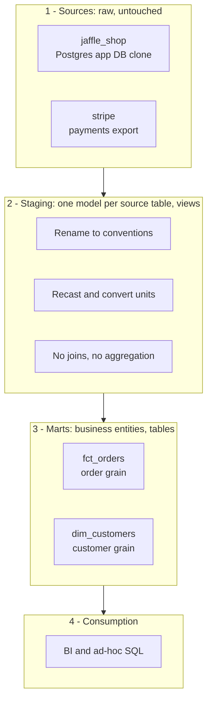
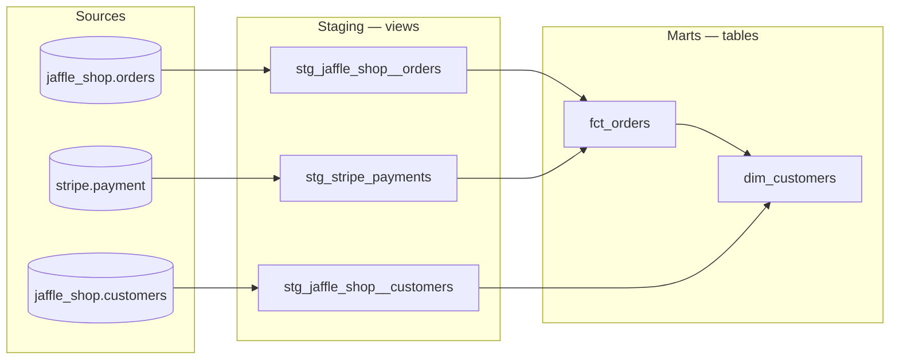
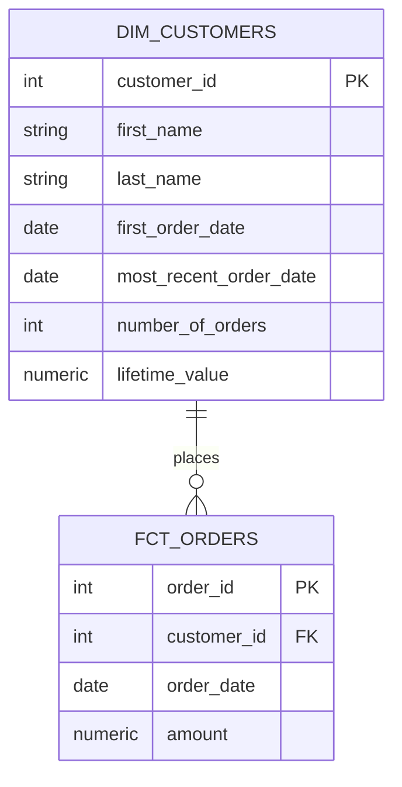
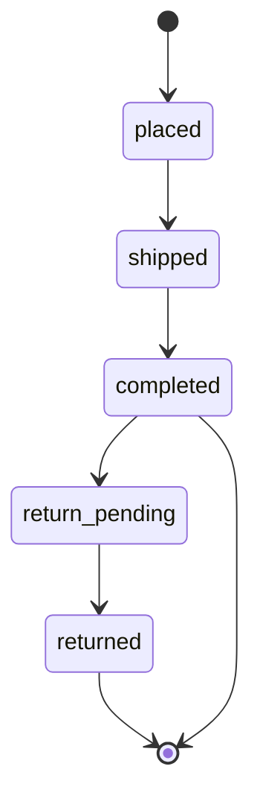

# Jaffle Shop — dbt Analytics Engineering Project

A dimensional warehouse built with **dbt** over two source systems: a Postgres application database (`jaffle_shop`) and a Stripe payments export. It takes raw operational tables and turns them into a tested, documented, analytic-ready star schema that answers questions like *what is each customer's lifetime value?* and *how much revenue has actually been collected per order?*

Built while completing **dbt Fundamentals** (dbt Labs), then extended with full column-level documentation, a wider test suite, and source freshness monitoring.

---

## Contents

- [The business problem](#the-business-problem)
- [Architecture](#architecture)
- [Data lineage](#data-lineage)
- [The data model](#the-data-model)
- [Models reference](#models-reference)
- [Data quality strategy](#data-quality-strategy)
- [Project structure](#project-structure)
- [Conventions](#conventions)
- [Running this project](#running-this-project)
- [Design decisions and trade-offs](#design-decisions-and-trade-offs)
- [Skills demonstrated](#skills-demonstrated)

---

## The business problem

Jaffle Shop's data is split across two systems:

| Problem                           | Where it comes from                                                 |
| --------------------------------- | ------------------------------------------------------------------- |
| Order records contain no revenue  | The application database tracks orders; money lives in Stripe       |
| Failed payments inflate revenue   | The raw feed includes`fail` attempts alongside `success`        |
| No customer-level view exists     | Order counts and lifetime value have to be recomputed each time    |
| `status` means different things | The same column name appears in both systems with different domains |

This project resolves all four in the transformation layer, so the presentation layer hands analysts numbers they can trust without caveats.

---

## Architecture

A conventional three-layer dbt structure. Each layer has exactly one responsibility, which is what keeps the logic easy to trace when a number looks wrong.



**Why the split matters:** staging is deliberately boring — rename, recast, one row-for-row with the source. All joins, aggregation and business rules live in marts. When revenue looks wrong, there is exactly one file to open.

---

## Data lineage

The full DAG dbt resolves from `ref()` and `source()` calls:



---

## The data model

A star schema at the presentation layer:



### Order status lifecycle

`order_status` is defined once in a dbt docs block (`jaffle_shop_docs.md`) and reused by reference, so the definition lives in one place and surfaces in the generated docs site:



| Status             | Definition                                       |
| ------------------ | ------------------------------------------------ |
| `placed`         | Order placed, not yet shipped                    |
| `shipped`        | Order has been shipped, not yet delivered        |
| `completed`      | Order has been received by the customer          |
| `return_pending` | Customer indicated they want to return this item |
| `returned`       | Item has been returned                           |

---

## Models reference

### Staging

| Model                          | Grain               | Materialization | What it does                                                                                                                                              |
| ------------------------------ | ------------------- | --------------- | --------------------------------------------------------------------------------------------------------------------------------------------------------- |
| `stg_jaffle_shop__customers` | one customer        | view            | Renames`id` to `customer_id`                                                                                                                          |
| `stg_jaffle_shop__orders`    | one order           | view            | Renames keys;`status` becomes `order_status` to avoid collision with payment status                                                                   |
| `stg_stripe_payments`        | one payment attempt | view            | Renames flat source columns; converts`amount` from cents to dollars. Retains failed attempts so downstream models choose their own definition of "paid" |

### Marts

| Model             | Grain        | Materialization | What it does                                                                                                                                                                                                           |
| ----------------- | ------------ | --------------- | ---------------------------------------------------------------------------------------------------------------------------------------------------------------------------------------------------------------------- |
| `fct_orders`    | one order    | table           | Joins orders to payments and aggregates**only `success` payments** into `amount`, coalescing unpaid orders to `0`                                                                                          |
| `dim_customers` | one customer | table           | Left-joins customers to their order history to derive`first_order_date`, `most_recent_order_date`, `number_of_orders` and `lifetime_value`. Never-ordered customers are retained with `number_of_orders = 0` |

The `left join` in `dim_customers` is a deliberate choice: an inner join would silently drop signed-up-but-never-ordered customers, which is exactly the cohort a growth analyst wants to find.

---

## Data quality strategy

**28 tests** across three layers, plus freshness monitoring on both sources. Tests are placed where the failure actually originates, so a red test points at a cause rather than a symptom.

| Layer    | Tests | What it protects                                                                                                                                                                                                                                        |
| -------- | ----- | ------------------------------------------------------------------------------------------------------------------------------------------------------------------------------------------------------------------------------------------------------- |
| Sources  | 6     | Primary key integrity on raw`orders`, `customers` and `payment` — catches upstream loader problems before they propagate                                                                                                                         |
| Staging  | 12    | Uniqueness and not-null on every key, referential integrity from orders to customers and payments to orders, plus`accepted_values` on `order_status`, `payment_status` and `payment_method` to catch new enum values the source starts emitting |
| Marts    | 9     | Grain enforcement (`order_id`, `customer_id` unique), non-null revenue and dates, and an `fct_orders` to `dim_customers` relationship test confirming no orphaned orders                                                                        |
| Singular | 1     | `assert_stg_stripe__payment_total_positive` — a custom SQL assertion that no order has a negative successful-payment total, a business rule no generic test expresses                                                                                |

### Source freshness

| Source                 | Warn after | Error after | Timestamp field    |
| ---------------------- | ---------- | ----------- | ------------------ |
| `jaffle_shop.orders` | 6 hours    | 24 hours    | `_etl_loaded_at` |
| `stripe.payment`     | 12 hours   | 24 hours    | `_batched_at`    |

Different thresholds because the pipelines have different cadences — a Stripe export lagging 6 hours is normal, an orders pipeline lagging 6 hours is not.

---

## Project structure

```
dbt-jaffle-shop/
├── dbt_project.yml                          # Project config; materialization defaults per layer
├── packages.yml                             # dbt-labs/codegen for scaffolding YAML and boilerplate SQL
├── models/
│   ├── staging/
│   │   ├── jaffle_shop/
│   │   │   ├── _src_jaffle_shop.yml         # Source definitions, key tests, freshness SLAs
│   │   │   ├── _stg_jaffle_shop.yml         # Model and column docs plus tests
│   │   │   ├── jaffle_shop_docs.md          # Reusable docs block for order_status
│   │   │   ├── stg_jaffle_shop__customers.sql
│   │   │   └── stg_jaffle_shop__orders.sql
│   │   └── stripe/
│   │       ├── _src_stripe.yml
│   │       ├── _stg_stripe.yml
│   │       └── stg_stripe_payments.sql
│   └── marts/
│       ├── _marts.yml
│       ├── dim_customers.sql
│       └── finance/
│           └── fct_orders.sql
└── tests/
    └── assert_stg_stripe__payment_total_positive.sql   # Singular test
```

---

## Conventions

These are applied consistently across the project — the point of a convention is that a reader can predict the next file without opening it.

| Convention                                     | Example                                                  | Reason                                                                                                |
| ---------------------------------------------- | -------------------------------------------------------- | ----------------------------------------------------------------------------------------------------- |
| Staging models named`stg_<source>__<entity>` | `stg_jaffle_shop__orders`                              | Double underscore separates source from entity, so the origin is visible in every downstream`ref()` |
| Marts prefixed`fct_` / `dim_`              | `fct_orders`, `dim_customers`                        | Grain is legible from the name alone                                                                  |
| Keys renamed to`<entity>_id`                 | `id` becomes `customer_id`                           | Makes joins self-documenting and`using (customer_id)` safe                                          |
| Ambiguous columns qualified                    | `status` becomes `order_status` / `payment_status` | Both sources ship a`status` column with different domains                                           |
| CTEs over subqueries, one CTE per step         | `source` → `renamed` → `final`                   | Each model reads top-to-bottom as a pipeline                                                          |
| YAML files prefixed with`_`                  | `_stg_jaffle_shop.yml`                                 | Sorts configuration to the top of the directory listing                                               |
| Repeated definitions in docs blocks            | `{{ doc('order_status') }}`                            | One definition, referenced everywhere — no drift between models                                      |

---

## Running this project

Developed in **dbt Studio** against BigQuery, using the public `dbt-tutorial` dataset.

```bash
# 1. Install dbt with your warehouse adapter
pip install dbt-bigquery        # or dbt-snowflake / dbt-postgres / dbt-duckdb

# 2. Install packages
dbt deps

# 3. Confirm the connection resolves
dbt debug

# 4. Build every model and run every test
dbt build

# 5. Check that sources are arriving on time
dbt source freshness

# 6. Generate and serve the docs site, including the lineage graph
dbt docs generate && dbt docs serve
```

To run locally, add a `default` profile to `~/.dbt/profiles.yml` (this file lives outside the repo and is never committed):

```yaml
default:
  target: dev
  outputs:
    dev:
      type: bigquery
      method: oauth              # or service-account, if you're using a key file
      project: <your-gcp-project>
      dataset: dbt_<your_name>
      # keyfile: /path/to/keyfile.json   # only needed for method: service-account
      location: US
      threads: 4
```

`dataset` is your own sandbox — dbt creates it on first run. It's separate from the `dbt-tutorial` source data, which is read directly via the `database:`/`schema:` pinned in each source's `.yml` file, regardless of your target dataset.

### Viewing the lineage graph (DAG) locally

`dbt docs generate` builds `target/manifest.json` and `target/catalog.json`; `dbt docs serve` hosts the same docs site dbt Studio embeds, on `http://localhost:8080` by default:

```bash
dbt docs generate && dbt docs serve
```

Open the URL it prints, then click the graph icon in the bottom-right corner for the full DAG, or open any model's page for its local lineage. The site is a static snapshot of the manifest/catalog — after editing a model or `.yml` file, stop the server (Ctrl+C), rerun `dbt docs generate`, then `dbt docs serve` again (or `dbt build`, which also refreshes the manifest) to see the update.

Useful selectors while developing:

```bash
dbt build --select staging          # just the staging layer
dbt build --select +fct_orders      # fct_orders and everything upstream of it
dbt build --select dim_customers+   # dim_customers and everything downstream
dbt test  --select source:stripe    # only the Stripe source tests
```

---

## Design decisions and trade-offs

**1. `dim_customers` reads from `fct_orders` rather than from staging.**
This keeps the aggregation in one place, but it couples two presentation-layer models and risk circular dependency. Facts and dimensions should not depend on each other. The cleaner shape is an intermediate model (`int_customer_orders`) that both marts consume, leaving `fct_orders` and `dim_customers` as siblings. The current version reflects the course build.

**2. `lifetime_value` is nullable while `number_of_orders` is not.**
A customer with no orders gets `number_of_orders = 0` but `lifetime_value = null`. That is intentional — null means "never transacted", which is genuinely different from "spent $0" — but it is the kind of choice that belongs in a column description rather than in a reader's head, so it is documented in `_marts.yml`.

**3. Failed payments are kept in staging and filtered in marts.**
Staging stays a faithful representation of the source; the `payment_status = 'success'` filter lives in `fct_orders`, where it is a business rule. If finance later wants a payment-failure-rate metric, the data is still there.

**4. Marts are tables, staging are views.**
Views cost nothing to keep fresh and staging is only ever read by marts. Marts are queried repeatedly by BI tools, so the storage is worth the query performance.

**5. Not yet covered.**
Snapshots for slowly-changing dimensions, incremental materializations, and CI checks on pull requests are the natural next additions. They were out of scope for the fundamentals build, and the current data volume does not justify incremental logic.

---

## Credits

Source data and the Jaffle Shop scenario come from dbt Labs' **dbt Fundamentals** course.
